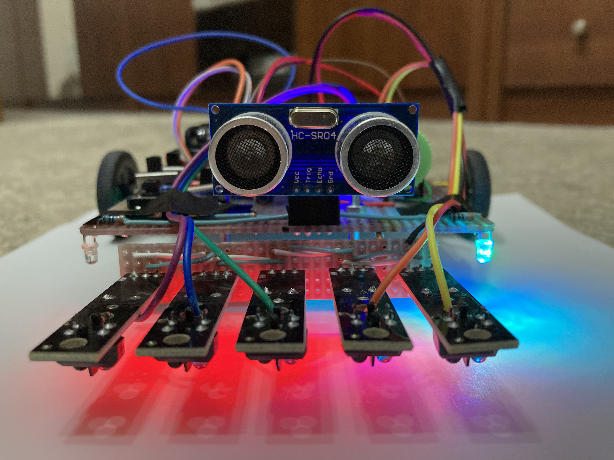
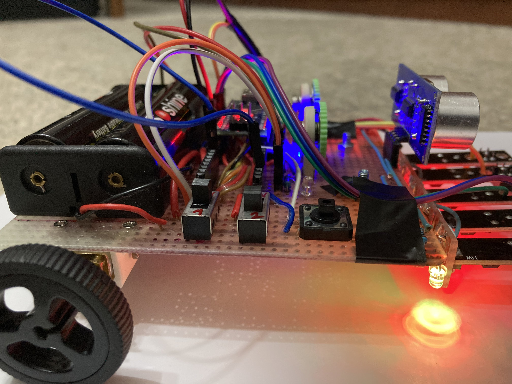
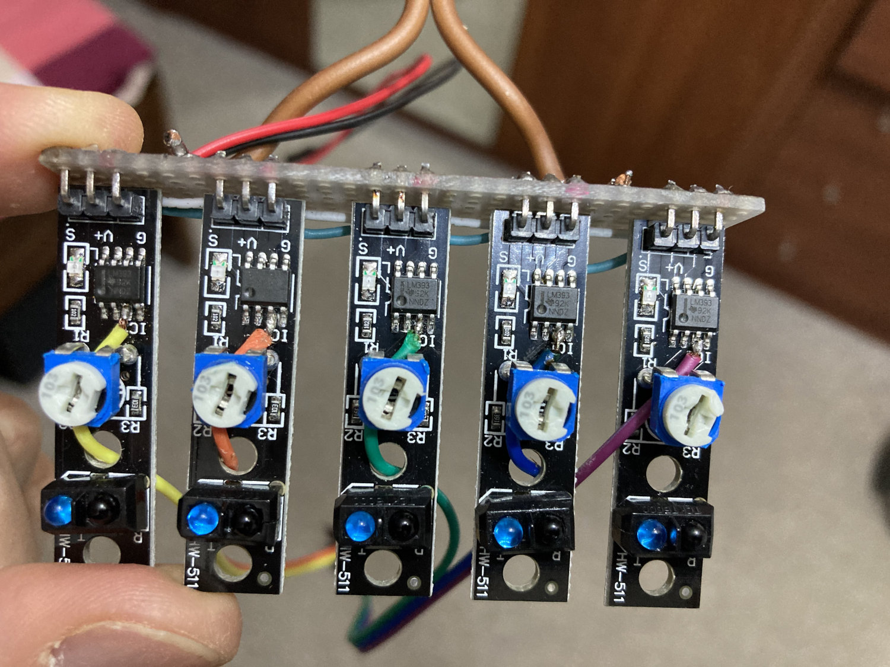
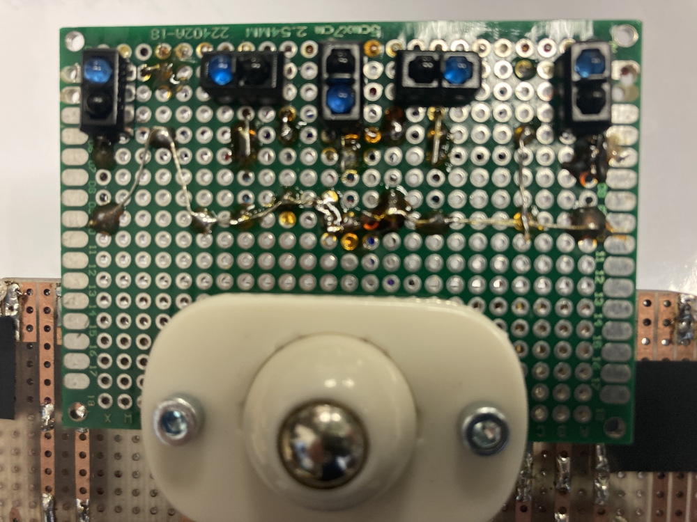
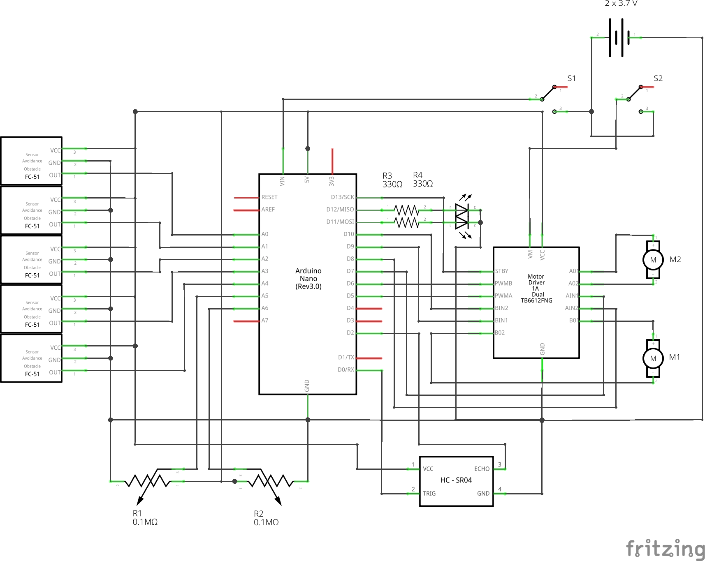

# A line following robot

Robotek na experimentální DPS, který sleduje čáru <del>a zastaví před překážkou &mdash; dle zadání na zápočet do Robotiky a automatizace</del>. Postaven na Arduino Nano <del>nebo kompatibilním GT8F328P</del>, řadiči motorů TB6612FNG, používá 5 IR čidel TCRT5000, <del>UZ čidlo HC SR-04</del>, 6V motorky N20 1000rpm, 2 trimry pro ladění parametrů a 2 LED (modrou a červenou) pro signalizaci různých stavů. Dále je připojeno tlačítko a 2 spínače. Jeden spínač pro napájení digitální části, druhý spínač pro napájení motorků (Toshiba v dokumentaci k TB6612 píše, že nikdy nemá být připojeno napájení motorků dříve, než je pod napětím digitální část. Když jsem poprvé připojil na můstek napětí na motorovou část, přičemž logická část nebyla napájena, explodovala jedna ze součástek. Na stranu druhou se mi párkrát povedlo omylem vypnout prvně napájení elektroniky a přežilo to. Ale lepší to asi zbytečně nepokoušet). Tlačítko slouží pro spuštění/zastavení jízdy.

Čidla jsou čtena <strong>analogově</strong>, senzory díky tomu dokážou načítat hodnoty celkem hezky průběžně, ne skokově, jak je tomu u digitálního čtení, je ale tím pádem potřeba před jízdou dělat kalibraci senzorů (teda vlastně není, ale určitě je to lepší, protože se díky ní čidla přizůsobí aktuálnímu prostředí). Ta naběhne automaticky po zapnutí, stačí autíčko postavit někam k&nbsp;čáře, případně &mdash; pokud není zapnuto napájení motorů &mdash; s ním ručně pohybovat senzory nad čarou. Já mám zakoupeny moduly, které mají pouze digitální výstup, takže byla potřeba malá úprava:

I tahle úprava nakonec ale skončila zpět v šuplíku. Obětoval jsem oboustrannou experimetální destičku 7&times;5 cm a vyrobil si svůj &bdquo;modul&ldquo;. Čidla jsem použil opět TCRT5000, opět je jich pět, ale dal jsem je symetricky a tak, aby byla vnitřní tři čidla blízko sebe a krajní jsou na okraji destičky a přijdou si na své jen v prudkých zatáčkách. Všechny součástky používají společné plus, přičemž fototranzistor je k zemi připojen emitorem přes odpor 10 k&ohm; a data jsou brána přímo z emitoru. UV diody jsem připojil původně přes 220 &ohm;. To je fajn, když je jedna. Ale když je jich paralelně pět, tak to potom nepřečte vůbec nic. Takže jsem ke každému odporu přidal sériově ještě 470 &ohm;, dohromady je to tedy 690 &ohm;. Takže volte podobný odpor. Pokud byste dávali čidel ještě více, budete možná muset jít ještě výše. Ani s takovým odporem pak není potřeba být čidly moc u země, právě naopak, původní výšku jsem ještě navyšoval. Ne proto, že by to nefungovalo, ale když mají čidla od čtené linky větší odstup, mění se získaná hodnota plynuleji, protože se sousední senzory navzájem ruší, což je ale pro nás žádané. Chce to vyzkoušet, já mám součástky cca 1&nbsp;cm od země. A ještě pozor na ta TCRTéčka &mdash; mám je ze dvou zdrojů a nejsou stejně smontovaná, takže si každou součástku před připojením změřte. Nejsnáze měřákem na diody. Ten fototranzistor je potřeba osvítit tou UV LEDkou, jinak samozřejmě nic neukáže.

Pro řízení využívá proporcionálně-integračně-derivační algoritmus. Pomocí trimrů je možno si nastavovat, co je potřeba, a&nbsp;po doladění je možno jejich použití úplně zrušit. Tedy pokud se vám podaří docílit stejných hodnot na baterku a z USB. Když jsem totiž vyladil parametry pomocí trimrů, zadal je natvrdo a trimry vypnul, tak hodnoty neseděly. Ale dá se od nich určitě odrazit. A nebo trimry nachat zapojené, i když hrozí, že si parametry rozhodíte. 

<del>Z důvodu, že jsem napíchnul ultrazvukový senzor na RX pin, je zablokováno jeho použití v ladicím režimu, protože už to tak mám vyleptáno na DPS, ale není problém připojit ho na D3, který jsem plánoval pro servomotorek a zůstal volný...</del>

Schéma (ještě původní s ultrazvukem a koupenými IR moduly) vypadá nějak takto:

Součástky:

<ul>
<li><a href="https://www.aliexpress.com/item/1005002524993718.html">motor s úchytem a kolem</a></li>
<li><a href="https://www.aliexpress.com/item/32465698640.html">H-můstek TB6612FNG</a></li>
<li>5&times; TCRT5000 + rezistory 10 k&ohm; + cca 700 &ohm;</li>
<li>Arduino Nano, <del>UZ modul HC SR-04,</del> tlačítko, 2 spínače&hellip;</li>
<li>Držák na 2 lithiovky a ty baterky k tomu. Já používám 18650, ale pokud máte 14500, ušetříte na hmotnosti a vejdou se vám do držáku na AA.</li>
</ul>

To nejdůležitější na závěr. Pokud si budete procházet kód, můžete si všimnout, že před načítáním čidel vypínám přerušení <code>noInterrupts();</code> a pak ho zase zapínám. Další prapodivností je přidaný <code>delay</code> na konci každého cyklu. Přijít na to mi trvalo dost dlouho, a asi bych něco takového vůbec nezkoušel, nebýt toho, že jsem zkoušel mikrokontroler LGT8F328, který je rychlejší než Arduino. Jenže paradoxně se choval, jakoby vůbec nestíhal. Až mě napadlo zkusit doplnit pauzu&hellip; A&nbsp;pak jsem doplnil pauzu i Arduinu, když jsem přidal rychlejší motorky &mdash; bez ní jsem nebyl schopen ujet ani metr přes veškeré snahy o doladění. A&nbsp;s&nbsp;pauzou se najednou robotek přilepil k&nbsp;čáře. No, tak ne, ale sledování čáry je o několik levelů lepší. Je lepší o tolik, že mi drží lajnu lépe, než když měl předtím motorky 200rpm. A~poslední věc &mdash; znovu zmíním ty senzory. Pokud budete mít senzorů málo, opravdu ty uvnitř nahustěte k sobě, nesnažte se o žádné lineární rozložení.

